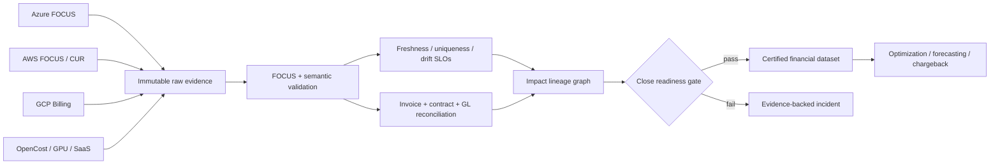

# Multi-Cloud FinOps Data Quality Platform

Open-source **cloud billing data observability**, **FOCUS validation**, invoice reconciliation, cost allocation, lineage and financial-close automation for **Azure Cost Management**, **AWS Cost Explorer and CUR**, **GCP Cloud Billing**, Kubernetes, GPU infrastructure and SaaS.

> Optimization built on unreliable billing data produces confidently wrong savings. This project tests the financial data before downstream FinOps, chargeback, forecasting or AI automation may trust it.

## What actually works

- Strict normalized billing schema with source evidence URIs
- Freshness SLO validation
- Duplicate charge-row detection
- Required lineage and allocation checks
- Fail-closed currency validation
- Provider invoice-to-usage reconciliation
- Usage-to-general-ledger reconciliation
- Materiality thresholds using decimal arithmetic
- Impact lineage from failed controls to financial products
- Deterministic close-readiness score and SHA-256 evidence envelope
- Known-good and intentionally broken multi-cloud fixtures

## Quick start

```bash
python -m venv .venv
. .venv/bin/activate
python -m pip install -e .

finops-reliability fixtures/billing-bad.csv \
  --invoices fixtures/invoices-bad.csv \
  --ledger fixtures/ledger-bad.csv \
  --as-of 2026-09-08

python -m unittest discover -s tests
```

The broken fixture proves detection of duplicate records, mixed currencies, stale data, unallocated spend, invoice variance and ledger variance. The good fixture must receive a 100/100 close-readiness score.

## Control catalogue

| ID | Control | Downstream impact |
|---|---|---|
| FIN-FRESH-001 | Export freshness | Forecasts, anomaly detection, close |
| FIN-UNIQ-001 | Unique billing rows | Reconciliation, chargeback, unit economics |
| FIN-DIM-001 | Required lineage and allocation | Product margin and customer showback |
| FIN-CUR-001 | Single normalized currency | Forecasts and executive reporting |
| FIN-REC-001 | Usage-to-invoice reconciliation | Provider payment and savings verification |
| FIN-GL-001 | Usage-to-ledger reconciliation | Financial statements and budget variance |

## Production architecture



The open FOCUS Validator should be integrated for formal specification rules; this project does not reimplement or claim FOCUS certification. Its distinct responsibility is continuous operational reliability, reconciliation, lineage and financial-close gating.

## Evidence boundaries

- An LLM may explain a control result but cannot change its status or monetary calculation.
- Mixed currencies are blocked until an explicit, evidenced FX transformation occurs.
- Source identifiers must be sanitized before public disclosure.
- Fixture results demonstrate software behavior—not customer savings or commercial ROI.
- A close-ready result means configured controls passed; it is not an audit opinion.

## Deployment path

Use ADLS/S3-compatible object lock for raw evidence, PostgreSQL for the ledger, OpenTelemetry for pipeline SLOs, dbt/DuckDB for transformations, and Power BI or Grafana for reporting. Production identities should be read-only and tenant-scoped. Remediation happens through reviewed code changes.

## Product KPIs

- Export freshness SLO
- Spend passing validation
- Invoice-to-export and export-to-GL variance
- Allocation coverage
- Unowned spend
- Mean time to detect and resolve
- False-positive rate
- Financial-close duration
- Downstream decisions blocked before using defective data

For multi-cloud FinOps architecture, implementation or managed operations: [A2Z SOC](https://a2zsoc.com/).

## License

Apache-2.0.
